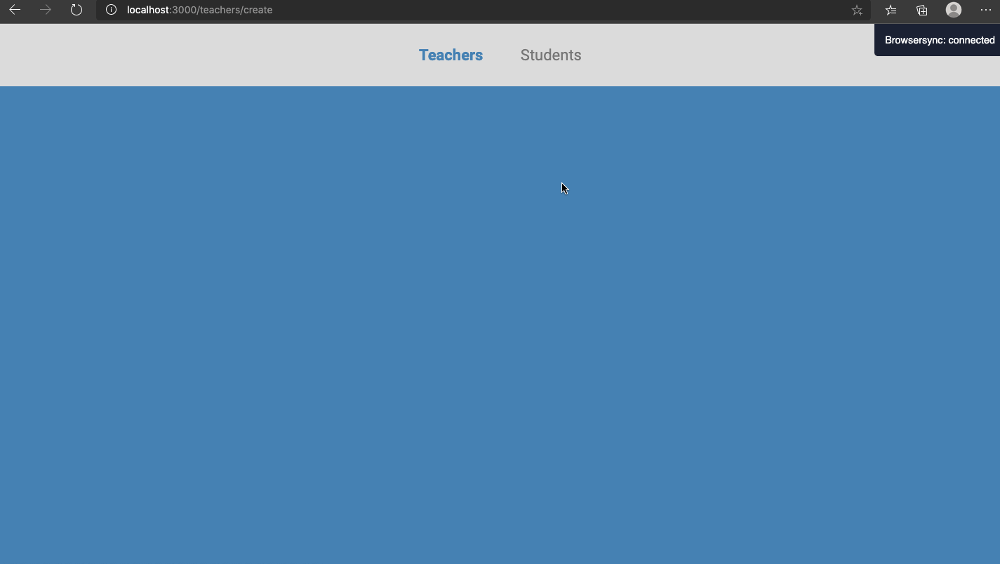

<h1 align="center">
    
    <br>
</h1>

<h2 align="center">
  <a href="https://github.com/DicoMonteiro/school_management/views">HTML</a> + <a href="https://github.com/DicoMonteiro/school_management/public">CSS</a> + <a href="https://github.com/DicoMonteiro/school_management/controllers">Javascript</a> + <a href="https://github.com/DicoMonteiro/school_management">NodeJS</a>
</h2>

<h4 align="center">
  It's an app for waste collection created during <a href="https://rocketseat.com.br/launchbase">Launchbase</a>
  <br>
  Created with :purple_heart: by <a href="https://rocketseat.com.br/">Rocketseat</a>
</h4>

## :video_camera: Demonstration

#### Front-end

## Desafio School Management
<h2 align="center">
  
</h2>

## :rocket: Technologies

#### Front-end

-  [Javascript](https://www.w3schools.com/js/)
-  [HTML](https://www.w3schools.com/html/)
-  [CSS](https://www.w3schools.com/css/)
-  [VS Code][vc]
  
#### Back-end

-  [NodeJS](https://nodejs.org/en/)
-  [Express](https://expressjs.com/)
-  [Nunjucks](https://www.npmjs.com/package/nunjucks)

## :information_source: How To Use

To clone and run this application, you'll need [Git](https://git-scm.com) and installed extensions (HTML, Javascript, CSS) on your IDE and installed NodeJS. From your command line:

```bash
# Clone this repository
$ git clone https://github.com/DicoMonteiro/school_management

# Go into the repository about HTML
$ cd src/views

# Go into the repository about CSS
$ cd public

# Go into the repository about Javascript
$ cd public/controllers

# Run the projects
npm install
npm start

```

## :memo: License
This project is under the MIT license. See the [LICENSE](https://github.com/DicoMonteiro/gym_management/LICENSE) for more information.

---

Made with :purple_heart: by Adriano Almeida :wave: [Get in touch!](https://www.linkedin.com/in/adriano-barreto-monteiro-almeida/)

[vc]: https://code.visualstudio.com/
